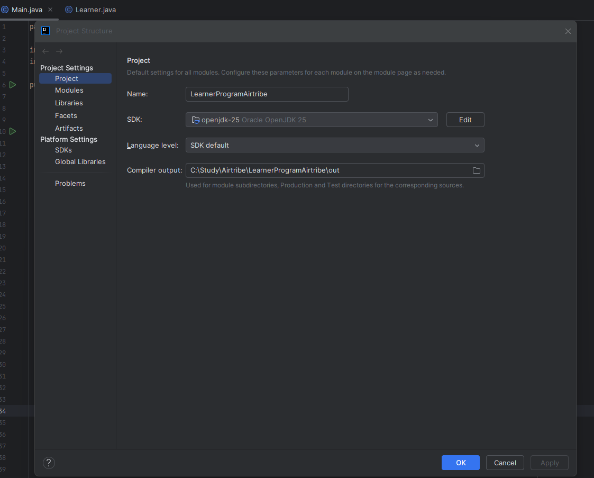
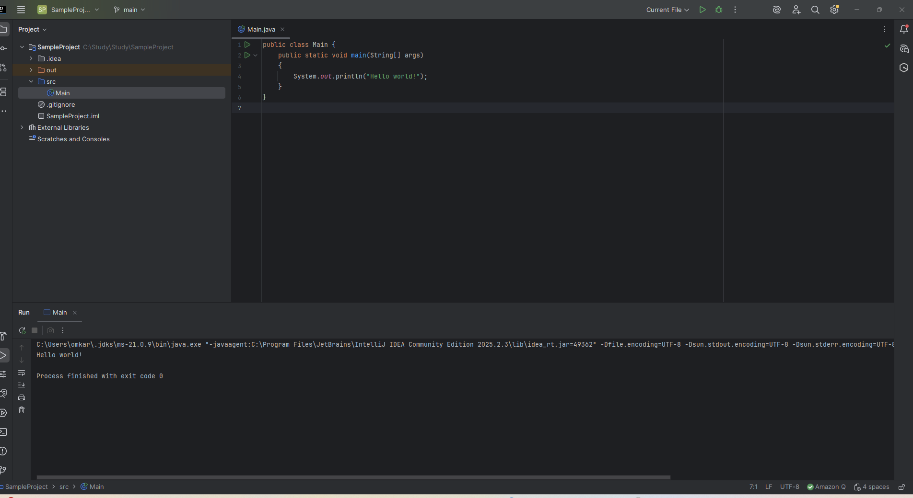
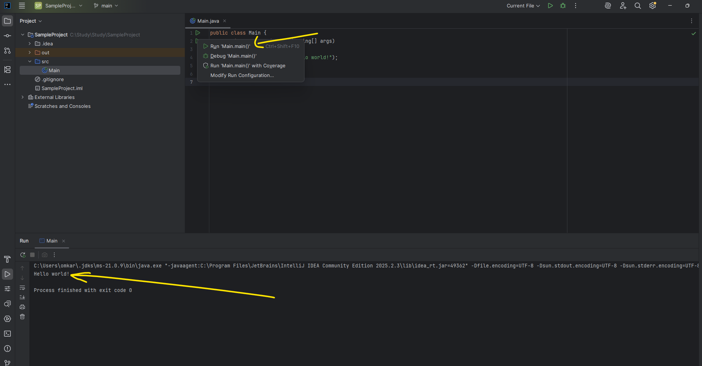

JDK version used
Open JDK 25 

SS1 created new project under src folder main class inside main method,
wrote Sysout statement to print the Hello World!

After that we need to run the program Main.main

